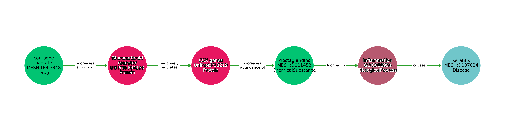

# Curation Guide

## Record Composition

Each record in DrugMechDB is a directed [graph](https://en.wikipedia.org/wiki/Graph_theory) consisting of the concepts
and relationships (aka nodes and edges) that connect a Drug in an indication to its treated Disease. The majority of
records are a [path](https://en.wikipedia.org/wiki/Path_(graph_theory)), consisting of a singular sequence of steps from
Drug to Disease.

Concepts of within DrugMechDB are mapped to universal identifiers as well as a [concept type](#concept-types).
Relationships are mapped to [relationship types](#relationships). These facets function to enhance the
machine-readability and reusability of the data contained within DrugMechDB.

An example of a record is illustrated below.

### Branching Paths

Some drugs produce their treatment effects through multiple interactions occurring simultaneously. This may
include the inhibition multiple targets that combine to produce their effect, or acting on multiple unrelated pathways
that acting on them individually would not have an affect on the disease. This situation can be represented through
a branching path, a simple example of which is pictured below.

If a branching path is used it should be because *multiple actions are converging to produce a given result*. This is in contrast
to multiple different expressions with equivalent meaning. For example, substituting 3 protein-to-compound interactions with
the one representation of pathway they belong to would not constitute a branched path, but rather equivalent expressions,
where only one should be selected.

### Format

YAML was chosen as a human friendly serialization standard for the content of DrugMechDB. YAML meets the primary
goal of machine readability and human-interoperability, important for the process of expert curation.
[For more information on the YAML standard, please follow this link](https://yaml.org/).

See [this sample](sample.yaml) for an example record, properly formatted in YAML.

### Components

Each record contains several components to produce a graph that is able to be consumed by programming languages
like Python, listed below. The following keys are required for a record (with more information on each provided below):
`directed`, `graph`, `links`, `nodes`, `multigraph`, and `reference`.

#### Graph

Information about the indication for this record. Includes the drug and disease names and their identifiers.

Example with a comment section, make sure to put a comment (singular) not comments: 

      -   comment: Cortisone acetate is a C21 acetate ester of cortisone, and acts as a prodrug of cortisone in the body.
          directed: true
          graph:
              disease: Keratitis
              disease_mesh: MESH:D007634
              drug: cortisone acetate
              drug_mesh: MESH:D003348
              drugbank: DB:DB01380
              
Example with no comment:

      -   directed: true
          graph:
              disease: Keratitis
              disease_mesh: MESH:D007634
              drug: cortisone acetate
              drug_mesh: MESH:D003348
              drugbank: DB:DB01380
         

#### Links

The relationships (or edges) in the graph. Each link contains a the identifiers for the `source` and `target` concepts in the
relationship as well as a `key` field for the [relationship type](#relationships). Links are ordered from
first link in the path with
`source` being the Drug in the indication and the final link's `target` being the Disease in the indication.

Example:

    links:
    -   key: increases activity of
        source: MESH:D003348
        target: UniProt:P04150
    -   key: negatively regulates
        source: UniProt:P04150
        target: UniProt:P23219
    -   key: increases abundance of
        source: UniProt:P23219
        target: MESH:D011453
    -   key: located in
        source: MESH:D011453
        target: GO:0006954
    -   key: causes
        source: GO:0006954
        target: MESH:D007634

#### Nodes

Nodes contain information on each of the concepts in the graph. Each node contains the fields `id`, `name`, and `label`
corresponding to the external identifier, the name of the concept, and they type of concept respectively. Each node `id`
must EXACTLY MATCH the identifiers used in the `source` and `target` fields for [links](#links). All identifiers used in the
links section must be included in the nodes section.

`id` is the most important field and has a few additional requirements. Each node should have a **single** identifier.
Ids must be preceded by the [CURIE](http://dragoman.org/comuri.html) for the source of
the identifier (For example `MESH:` for MeSH identifiers, or `UniProt:` for those from Uniprot).
One important caveat is that <code>: </code> (colon space) is a reserved character-set in YAML, so
identifiers must not contain  spaces. For example `MESH:D007249` is correct, but `MESH: D007249` will
produce an error and should not be used.

See the [Concept types](#concept-types) section for preferred identifier sources.

Alternate identifiers from non-preferred sources may be included as a list in an optional `alt_ids` field:

     nodes:
    -   id: MESH:D003348
        label: Drug
        name: cortisone acetate
    -   id: UniProt:P04150
        label: Protein
        name: Glucocorticoid receptor
    -   id: UniProt:P23219
        label: Protein
        name: COX genes
    -   id: MESH:D011453
        label: ChemicalSubstance
        name: Prostaglandins
    -   id: GO:0006954
        label: BiologicalProcess
        name: Inflammation
        alt_ids:
        - MESH:D007249
        - KEGG:hsa04062
    -   id: MESH:D007634
        label: Disease
        name: Keratitis       

#### Reference

Each record is to be annotated with a `reference` key linking to the data source where the record was curated from.

Example:

    reference:
    - https://go.drugbank.com/drugs/DB06708#mechanism-of-action
    - https://www.uniprot.org/uniprot/Q8IL04#function
    - https://en.wikipedia.org/wiki/Heme#In_health_and_disease
    
#### Comment section at the bottom of the yaml file

    reference:
    - https://go.drugbank.com/drugs/DB06708#mechanism-of-action
    - https://www.uniprot.org/uniprot/Q8IL04#function
    - https://en.wikipedia.org/wiki/Heme#In_health_and_disease
    comment: Lumefantrine is an antimalarial agent used in combination with artemether.

#### Additional keys

To aid in machine readability two additional keys are required, `multigraph` and `directed` both being set to `true`.

Example:

    -   directed: true
        multigraph: true

## Sources

Records from DrugMechDB should be curated from secondary sources. The primary source for curation is the
Mechanism of Action section from [DrugBank](https://go.drugbank.com/drugs/DB01380#mechanism-of-action) for
the drug in the indication.

Other acceptable sources include (but are not limited to) Review articles, Gene Ontology, UniProt, Reactome, and
well-sourced Wikipedia articles.

Primary sources, including manuscripts containing experimental results should **not** be used
for sources in DrugMechDB. DrugMechDB should consist of highly curated and high-confidence data, therefore sources
curated to produce new records should already contain a level of curation.

Finally, there may be many relationships within the source text. Only those relevant to the disease in the indication
should be represented in the record's final path.

## Data Model

The data model used for concepts and relationships in the curated records is derived from the
 [Biolink data model](https://biolink.github.io/biolink-model/). Only a subset of Biolink is used, with concepts and
 relationship vocabulary relevant biochemical interactions and disease processes. Please see below for preferred
 concept and relationship types.

### Concept Types

Concepts are limited to the following vocabulary. The preferred identifiers are listed below. In the event that an identifier
from one of these sources cannot be found for a concept, identifiers listed on the Biolink page for the concept type
(linked below) may be used, in order of preference as they appear on the page.

|Concept Type                                                    | Identifier Source    |
|-----------------------------------------------------------------------------------------------------|--------------------------|
|[BiologicalProcess](https://biolink.github.io/biolink-model/docs/BiologicalProcess.html)  |  [GO](http://geneontology.org/)  |
|[Cell](https://biolink.github.io/biolink-model/docs/Cell.html)  |  [CL](http://www.obofoundry.org/ontology/cl.html) |
|[CellularComponent](https://biolink.github.io/biolink-model/docs/CellularComponent.html)  |  [GO](http://geneontology.org/)  |
|[ChemicalSubstance](https://biolink.github.io/biolink-model/docs/ChemicalSubstance.html)  |  [MESH](https://meshb.nlm.nih.gov/), [CHEBI](https://www.ebi.ac.uk/chebi/) |
|[Disease](https://biolink.github.io/biolink-model/docs/Disease.html)  |  [MESH](https://meshb.nlm.nih.gov/)  |
|[Drug](https://biolink.github.io/biolink-model/docs/Drug.html)  |  [MESH](https://meshb.nlm.nih.gov/), [DrugBank](https://go.drugbank.com/) |
|[GeneFamily](https://biolink.github.io/biolink-model/docs/GeneFamily.html)  |  [InterPro](https://www.ebi.ac.uk/interpro/), [Pfam](https://pfam.xfam.org/) |
|[GrossAnatomicalStructure](https://biolink.github.io/biolink-model/docs/GrossAnatomicalStructure.html)  |  [UBERON](https://www.ebi.ac.uk/ols/ontologies/uberon)  |
|[MacromolecularComplex](https://biolink.github.io/biolink-model/docs/MacromolecularComplexMixin.html)  |  [PR](https://www.ebi.ac.uk/ols/ontologies/pr)  |
|[MolecularActivity](https://biolink.github.io/biolink-model/docs/MolecularActivity.html)  |  [GO](http://geneontology.org/)  |
|[OrganismTaxon](https://biolink.github.io/biolink-model/docs/OrganismTaxon.html)  |  [NCBITaxon](https://www.ncbi.nlm.nih.gov/Taxonomy/Browser/wwwtax.cgi)  |
|[Pathway](https://biolink.github.io/biolink-model/docs/Pathway.html)  |  [REACT](https://reactome.org/)  |
|[PhenotypicFeature](https://biolink.github.io/biolink-model/docs/PhenotypicFeature.html)  |  [HP](https://hpo.jax.org/app/)  |
|[Protein](https://biolink.github.io/biolink-model/docs/Protein.html)  |  [UniProt](https://www.uniprot.org/)  |

### Relationships

DrugMechDB currently uses a **limited subset** of the available predicates in the Biolink Data Model.

Unlike the concept types, this is not a hard limit on relationships. While ideally most relationships should be mapped
to one of the predicates previously used, if a relationship found in the process of curation does not fit neatly into
any of these types listed below, a predicate may be selected
from the [full set of biolink predicates](https://biolink.github.io/biolink-model/docs/predicates.html).

The predicates currently found within DrugMechDB are as follows:

[affects risk for](https://biolink.github.io/biolink-model/docs/affects_risk_for.html)  
[capable of](https://biolink.github.io/biolink-model/docs/capable_of.html)  
[caused by](https://biolink.github.io/biolink-model/docs/caused_by.html)  
[causes](https://biolink.github.io/biolink-model/docs/causes.html)  
[contributes to](https://biolink.github.io/biolink-model/docs/contributes_to.html)  
[correlated with](https://biolink.github.io/biolink-model/docs/correlated_with.html)  
[decreases abundance of](https://biolink.github.io/biolink-model/docs/decreases_abundance_of.html)  
[decreases activity of](https://biolink.github.io/biolink-model/docs/decreases_activity_of.html)  
[disrupts](https://biolink.github.io/biolink-model/docs/disrupts.html)  
[expressed in](https://biolink.github.io/biolink-model/docs/expressed_in.html)  
[expresses](https://biolink.github.io/biolink-model/docs/expresses.html)  
[has metabolite](https://biolink.github.io/biolink-model/docs/has_metabolite.html)  
[has output](https://biolink.github.io/biolink-model/docs/has_output.html)  
[has participant](https://biolink.github.io/biolink-model/docs/has_participant.html)  
[has phenotype](https://biolink.github.io/biolink-model/docs/has_phenotype.html)  
[in taxon](https://biolink.github.io/biolink-model/docs/in_taxon.html)  
[increases abundance of](https://biolink.github.io/biolink-model/docs/increases_abundance_of.html)  
[increases activity of](https://biolink.github.io/biolink-model/docs/increases_activity_of.html)  
[located in](https://biolink.github.io/biolink-model/docs/located_in.html)  
[location of](https://biolink.github.io/biolink-model/docs/location_of.html)  
[manifestation of](https://biolink.github.io/biolink-model/docs/manifestation_of.html)  
[molecularly interacts with](https://biolink.github.io/biolink-model/docs/molecularly_interacts_with.html)  
[negatively correlated with](https://biolink.github.io/biolink-model/docs/negatively_correlated_with.html)  
[negatively regulates](https://biolink.github.io/biolink-model/docs/negatively_regulates.html)  
[occurs in](https://biolink.github.io/biolink-model/docs/occurs_in.html)  
[part of](https://biolink.github.io/biolink-model/docs/part_of.html)  
[participates in](https://biolink.github.io/biolink-model/docs/participates_in.html)  
[positively correlated with](https://biolink.github.io/biolink-model/docs/positively_correlated_with.html)  
[positively regulates](https://biolink.github.io/biolink-model/docs/positively_regulates.html)  
[precedes](https://biolink.github.io/biolink-model/docs/precedes.html)  
[prevents](https://biolink.github.io/biolink-model/docs/prevents.html)  
[produced by](https://biolink.github.io/biolink-model/docs/produced_by.html)  
[produces](https://biolink.github.io/biolink-model/docs/produces.html)  
[regulates](https://biolink.github.io/biolink-model/docs/regulates.html)  
[treats](https://biolink.github.io/biolink-model/docs/treats.html)  

## Helpful hints for generating paths

Finding the 'best' set of relationships that describe a drug's action can be a subjective task. Free-text descriptions of a Drug's
mechanism may present information in a way that differs from the ideal path representation. Some editorialization is required
to produce the best path. The following are examples of editorialization that may need to be performed: changing the order of
interactions to better reflect cause and effect, removing extraneous interactions or information, capturing multiple related
concepts in a single all-encompassing concept.

Here are some general guidelines to help produce the highest quality paths:

- **Paths should generally begin with a Drug to Protein target interaction** Most drugs act through interaction
(either activation or inhibition) or a Protein, however there can be exceptions to this rule. Sometimes the exact protein target
is not known, but rather a class or family of proteins can be used. There may be cases where no known protein or class of
proteins are targeted, but the drug is instead known to affect some pathway or process. Finally there are also instances when
a drug acts through a means other than interacting with a protein target, like in the case of supplementation for a deficiency.

- **Predicates in paths should include a direction of influence wherever possible** For example if a Drug is known
to "bind" a protein, the term `molecularly_interacts_with` could be used to describe this relationship, however, this excludes
crucial information as to the nature of this "binding". Does it bind as an allosteric inhibitor? In this case `decreases activity of`
would be a better predicate choice. Is it binding as a receptor agonist? Then `increases activity of` is an appropriate choice.
Along the same line of reasoning, predicates like `regulates` should almost never be used in favor of `positively regulates` and
`negatively regulates`. Only in cases where either the direction of influence is unknown, or potentially both directions
simultaneously, should `regulates` be chosen. Similarly, predicates beginning with the word `affects` should be avoided
in favor of their `increases` and `decreases` counterparts.

- **Paths should be approximately 3 to 7 links in length** In branching paths, this means the longest branch, rather than
the total number of links.  Paths with 2 links is really only enough for a Drug-to-Target-to-Disease relationship, and doesn't generally
provide enough context as to how or why that Target is important to the Disease process. At the other extreme, once moving to 8 links
and beyond, there may be too much detail provided that could be better abstracted through the use of other terms. For example, a
chain of several Protein and Compound interactions could potentially be represented as a Pathway or a Biological Process instead.

- **Keep directed influence out of Nodes as much as possible** Some nodes, specifically Biological Process Gene Ontology
terms, can have a directed influence as a part of the node itself. For example, the GO Term "Positive regulation of vasoconstriction"
(GO:0045907) is a valid term, and a child term of the GO Term "vasoconstriction" (GO:0045907). However a link with "Protein X -
participates in - positive regulation of vasoconstriction" is less expressive in the actions of that protein and better represented
by using the base term with a directed predicate "Protein X - positively regulates - vasoconstriction".

- **Try to provide as much disease context as possible** Several diseases may be treated by the same drug through the
same Drug-Target interaction. In these cases, while it is OK to use similar paths, care should be taken to try to capture any
differences specific to the Disease in the indication that can help differentiate it from the Drug's other indications.

- **Paths should be logically consistent** “Treats” is a negative relationship. If a Drug treats a disease or symptoms, it is reducing
their overall effect. If we walk one by one down each link in a path and stop at each concept to ask "is this concept increasing or
decreasing due to the application of this drug" by the time we reach the Disease, the answer should be "decreasing".  In mathematical
terms, If all of the relationships in a path are relationships of influence (+1 for increases or -1 for decreases), the product of their
directions (e.g. the overall direction of influence of the path) should be negative. If the overall direction is positive, the path is
essentially saying that the Drug is contraindicated for the disease.

- **Each individual edge should stand on their own** 

Again, these are not hard fast rules and there will always be exceptions. However, these are a good starting point in an attempt
to produce the highest quality paths possible.

## Curating from GitHub Issues Indication Lists

We have provided in the Issues section of this repository, lists of indications that we would like curated. The Drug-Disease pairs
as well as their mapped identifiers come from [DrugCentral](https://drugcentral.org/) and therefore may contain some
inconsistencies. The following issues may come up in the pool of indications and here are some potential solutions.

- **The drug has been withdrawn** That's OK, at one point it was used for this indications and it would be good to have the
drug's mechanistic details catalogued. In this instance please include a comment for the path that includes the word 'withdrawn'.

- **The drug is actually contraindicated for the disease** In this case, if possible, a path with mechanism of the
 contraindication would be something that could potentially be curated. Also, please provide a comment for the path that includes
 the word 'contraindication'.

 - **There is no information under any (reasonable) source for this indication** This happens. Some drugs just work
 without a large amount of scientific description of the mechanism of action. In  this case please provide a single-link path that
 essentially consists of a "Drug treats Disease" path that will serve as an indicator to future curators that someone has
 attemped to curate this path.

- **The Drug has Multiple MESH IDs** These Identifiers come directly from DrugCentral. It may be that the Drug product
is a mixture of multiple compounds, therefore multiple are provided, however it may also be that one is wrong. In these cases,
if there is still only one Drugbank identifier, please use the Drugbank ID as the main identifier for the Drug in the paths.

- **The Identifier for the Drug or Disease is incorrect** Again these are sourced from DrugCentral and
there may be some mistakes. If you encounter a mistake during curation, please feel free to provide the correct external identifier
in your completed YAML.

- **A Drug or Disease identifier is missing** All provided indications should have both a Drugbank ID for the Drug and a
MESH ID for the disease. If the MESH ID is missing for the drug, that means that none were mapped from DrugCentral, so please
use the Drugbank identifier instead.

## FAQ

### How do I submit my new paths after curating them?

See the [Submission Guide](SubmissionGuide.md) for detailed instructions
for how to submit new paths and how to keep your fork synced to
the base repository.

### Is there somewhere I can validate/visualize my path?

Yes! We've added a jupyter notebook that can be used to visalize paths.
It can be executed by following [this link to Google CoLab](
https://colab.research.google.com/github/SuLab/DrugMechDB/blob/master/path_visualization.ipynb).

To run this code, copy paste your YAML code for **one** path into cell
number 2 and then  click `Runtime>Run all` and the CoLab notebook
will run the requred code to produce a picture of your graph.

### I don't see Gene listed on the node types

Yes, that is intentional. We are trying to think of these paths in terms of the direct interactions
between molecular entities. Because of this, we prefer relationships to and from the gene
product form (usually Protein) for these entities. If you come across a path where you think
the only only interaction is through a gene (i.e. a Regulatory gene that is never expressed)
let us know and we can consider adding Gene as a concept for this specific instance. However,
Protein (or other gene product) is almost always going to be the appropriate concept type.

### Is case sensitivity important?

Case sensitivity is important in Node Names and Node Labels.  In all other fields, case sensitivity will be normalized
to the standard within `indication_paths.yaml` after new additions are submitted via pull request.

### What should I annotate for General Bacterial Infections? UniProt identifiers are species specific!

In this case there are two options. 1. Choose a specific species and annotate a path that goes through the
proteins of that species and that species as *a* cause of the general bacterial infection. 2. Use the family of
proteins from a source like InterPro that are involved within this mechanism. Choice 1 is generally preferred to
choice 2, but either are fine.

### How should I annotate prodrugs and their pharmacologically inactive compounds?

[Prodrugs](https://en.wikipedia.org/wiki/Prodrug) are compounds that are converted within the body into a
pharmacologically active drug. The way you annotate the active and inactive forms of these compounds
(whether within the same path or as separate paths) should be assessed on a case by case basis. 

You should look into the DrugBank identifiers given to these compounds.

If there are two DrugBank IDs, the active and inactive compounds should be annotated in different paths. These are some examples:

    - [Testosterone](https://go.drugbank.com/drugs/DB00624) and [Testosterone propionate](https://go.drugbank.com/drugs/DB01420)
    
    - [Drostanolone](https://go.drugbank.com/drugs/DB00858) and [Drostanolone propionate](https://go.drugbank.com/drugs/DB14655)
   
If you can't find two DrugBank IDs, the active and inactive compounds should be annotated in one single path. These are some examples:

    - [Imidapril](https://go.drugbank.com/drugs/DB11783) and Imidaprilat
    
    - [Vidarabine](https://go.drugbank.com/drugs/DB00194) and Vidarabine Phosphate

The path could be represented as below:

   `Imidapril` HAS METABOLITE `Imidaprilat` DECREASES ACTIVITY OF `UniProt:P12821`
   
   `Vidarabine` HAS METABOLITE `Vidarabine Phosphate` DECREASES ACTIVITY OF `UniProt:P04293`

You can also check whether the two compounds are indicated for different diseases or for the same disease. If they are indicated for differente diseases,
it's likely they will be annotated as two different paths. So drug indications will further help you to decide on how to annotate prodrugs.

### I'm not sure which biolink predicate to use. Any helpful hits?

In the Biolink model, some predicates are only allowed certain types of nodes at the start and the end of the edge.
[This file](https://github.com/SuLab/DrugMechDB/blob/main/utils/dmdb_to_bl_map.csv) contains predicates and their
freqency in the first 100 or so paths curated for DrugMechDB. The columns `start_bl`, `type_bl`, and `end_bl` contain
the concept type and predicate information for the edge in the Biolink model used by DrugMechDB. The other columns
(`me` for example) contain concept types and predicates from other data models in repurposing space, like those
from the [hetionet model](https://github.com/hetio/hetionet).

