# Submission Guide

Submissions to DrugMechDB have now been converted to a new Github Actions system
which allows for automated integration of pull requests.

## Enable Github Actions

The first thing that is required to use the new submission system is the enabling of Github Actions for your account.
You can do so by clicking the 'Actions' tab and choosing to enable Github Actions.

## Claiming an indication group

Please use the [issue template for claiming a group](
https://github.com/SuLab/DrugMechDB/issues/new?assignees=&labels=upwork&template=indication-group-
curation-claim.md&title=Curating+indication+group+)
to claim a group of indications so that other curators do not work on the same indications.

The `.zip` file containing the full set of grouped indications can be [downloaded here](
https://github.com/SuLab/DrugMechDB/raw/main/dmdb_indications_grouped.zip).

Before claiming, please ensure that the group you wish to claim has not been previously claimed or completed. 
You can do this through searching the issues as shown in the image below. 

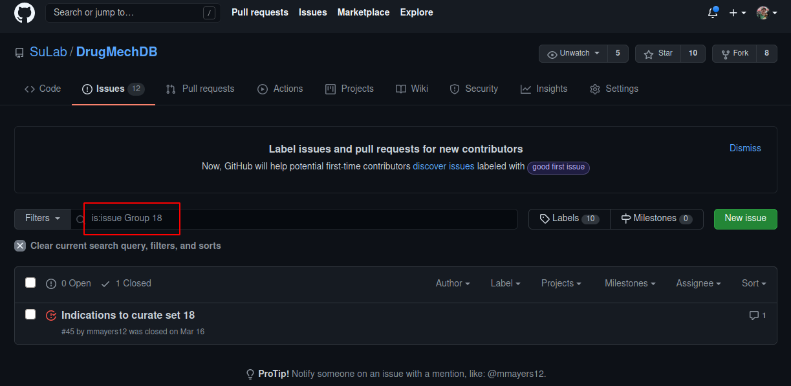

The following steps outline the claiming process

#### 1. Go to the project's issues page
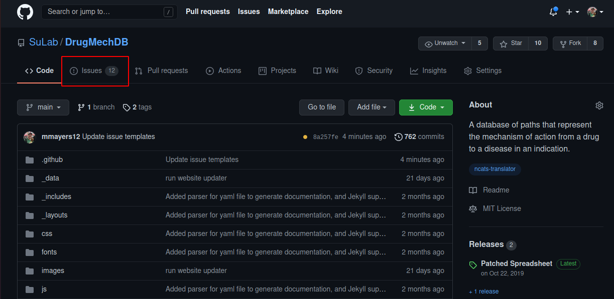

#### 2. Select 'New Issue'
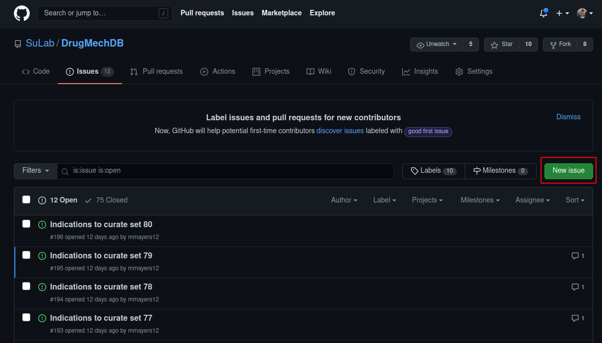

#### 3. Choose the 'Indication group curation claim' template and click 'Get started'
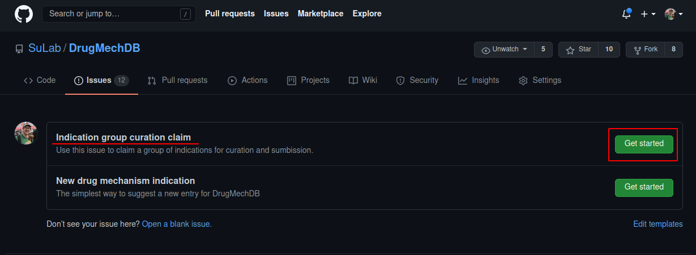

#### 4. Please add the group number to end of the issue title
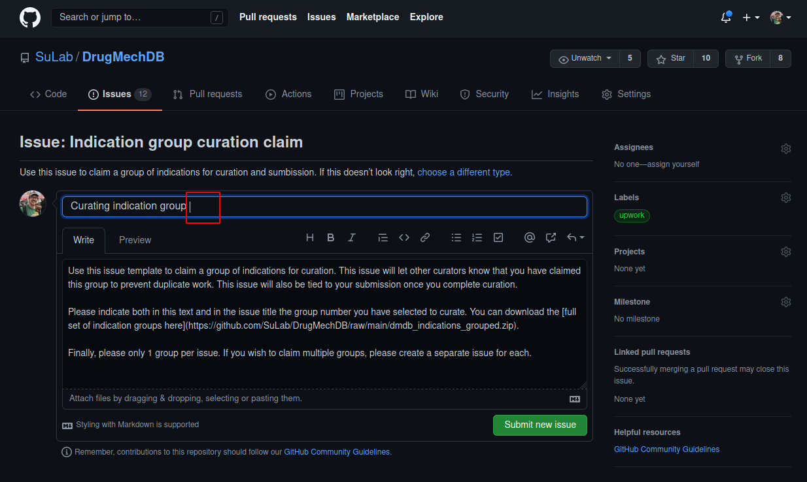

#### 5. Include the group number in the text as well
Feel free to replace the boilerplate text that appears in the template.
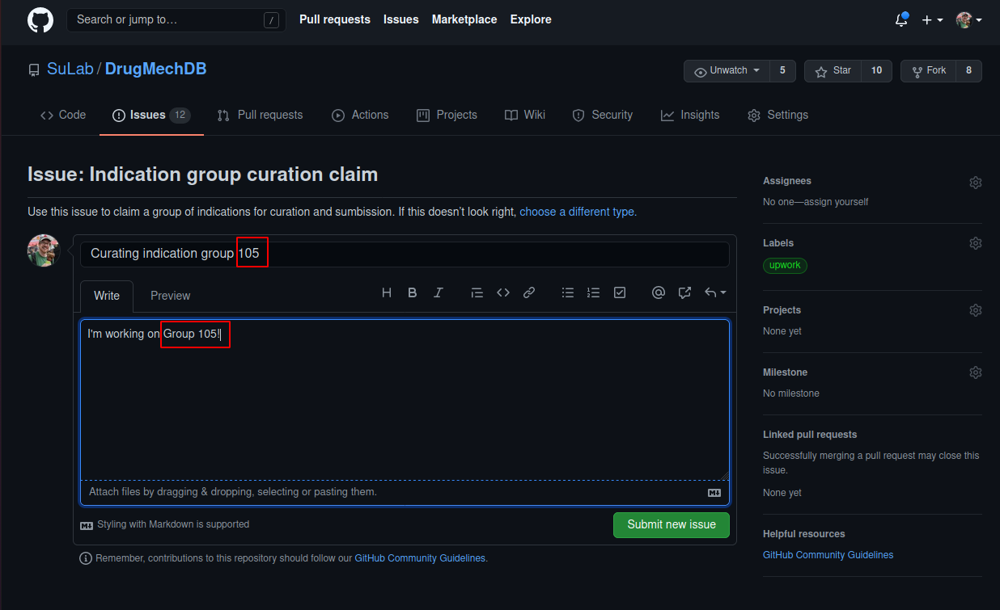

#### 6. Click 'Submit new issue'

## Submitting new paths.

New paths are to be submitted with the `submission.yaml` file. However, as this file will be constantly reset to
empty after every submission, it is **highly recommended** that you work in a separate file locally
while curating and only commit to this file once all changes are finished and ready to be submitted as a Pull Request.

The following guide will walk you through the steps for submitting new paths.

#### 1. Make edits to submission file and commit changes
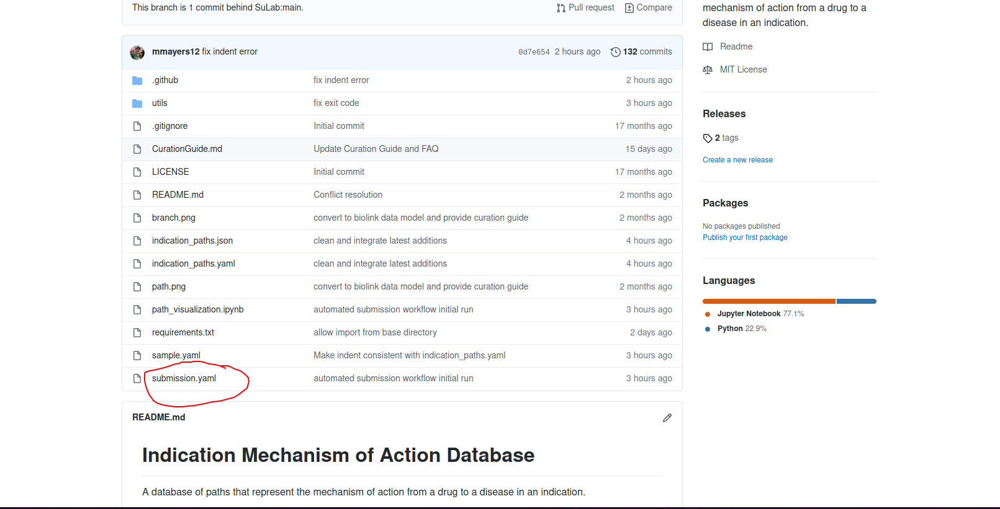

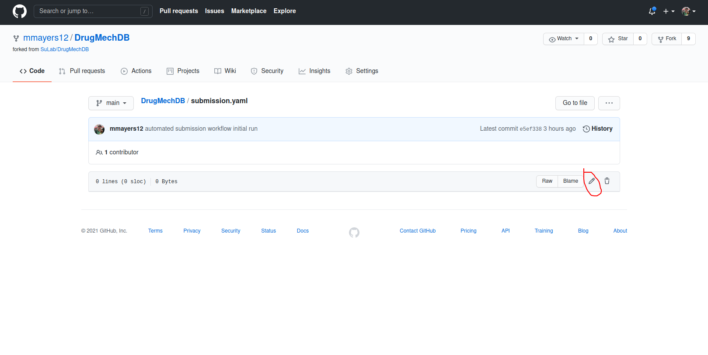
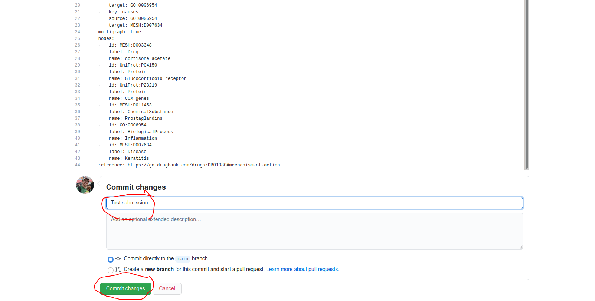

Be sure and add a descriptive commit message.

#### 2. Submit a pull request
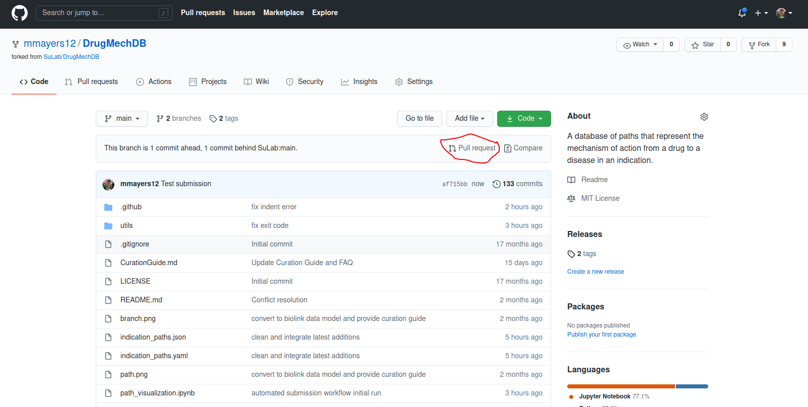
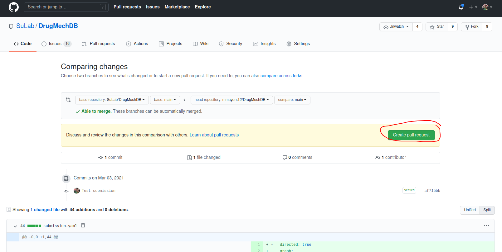

Again, please provide a description. If this submission corresponds to indications linked in one of the
issues, please provide either the issue number or the group number in the PR title.

#### 3. A pull request will now trigger Github actions Workflow

This workflow will test the file and integrate changes.

Yellow text indicates the workflow is running.

Green Check mark means that the workflow is complete and successful.  If this happens you don't need to do
anything else.

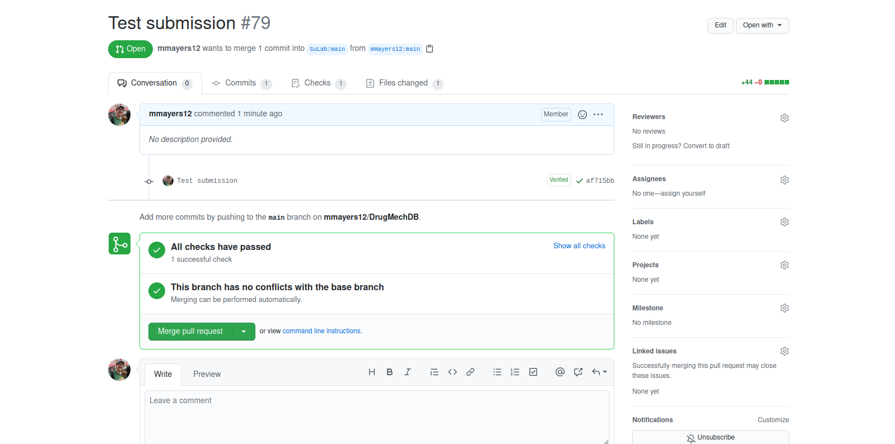

### Submission Error

If there are error in the submission file, the workflow will fail. Errors need to be corrected an
the submission file should be resubmited with a new Pull Request.

To determine why the check failed, click on the Details button on the right.  This will bring up Various Error Messages

##### Example Error 1

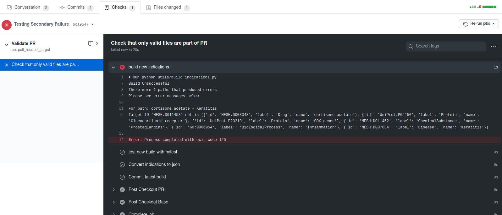

In this example, we see that one of our edge identifiers in the `'target_id'` position for the path
`cortisone acetate - Keratitis` is not present in the listed nodes.

##### Example Error 2

Here we have another error, this time the compiler cannot read the `submission.yaml` file. It describes what line
number is causing an error.

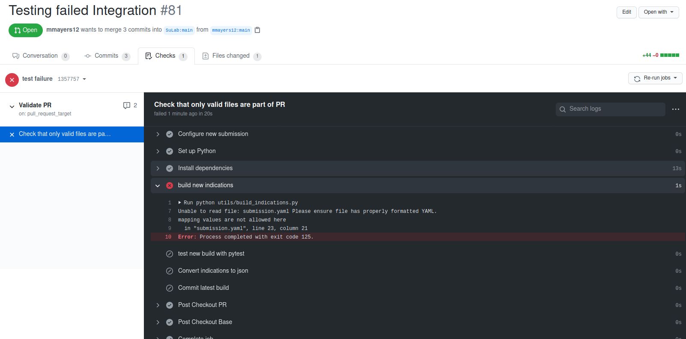

When we check the file, we see that the line has an identifier with an extra space within it, preventing the YAML
parser from correctly reading the file.

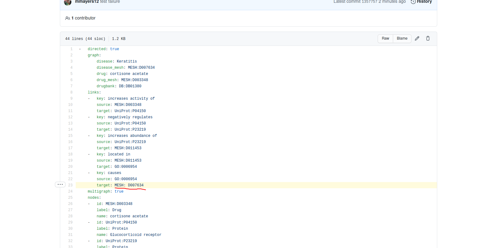

## Syncing your Fork

Keeping your fork up to date before submitting new paths is critical to ensuring that merge conflicts are minimized.
For this reason, we have implemented an action that automatically checks
for updates and creates pull requests to your account when they are found.
You can also trigger this manually to get the latest updates before making
a Pull Request.

### Manual Syncing using the Fork Sync action

#### Click the Actions Tab

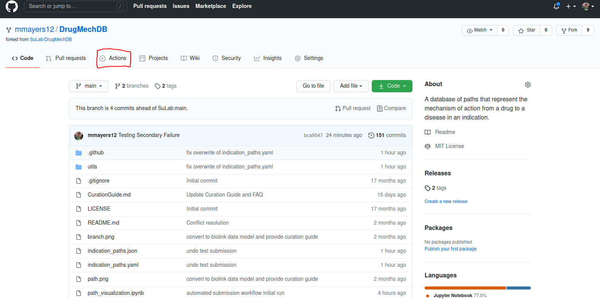

This will bring you to the Github Actions page for this repository.

#### Click Sync Fork action

#### Click run workflow

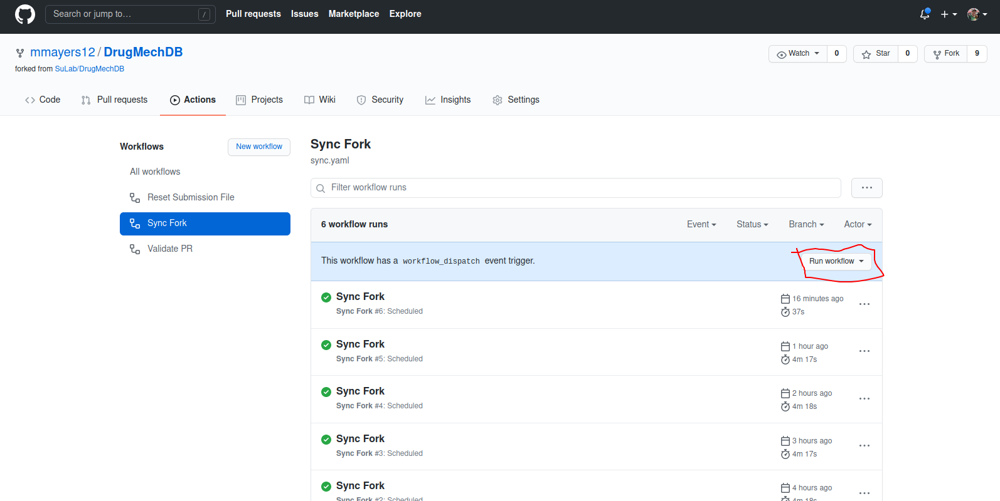

After clicking `run workflow`, a confirmation box will come up, click to confirm.

#### Workflow Running

The workflow will appear with yellow coloring to signal that it is currently running.

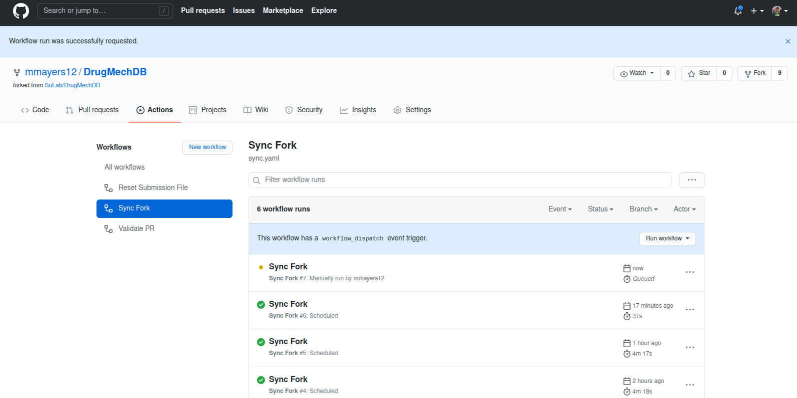

#### New Pull Request

If differences are found, a new pull request will appear in the pull requests tab

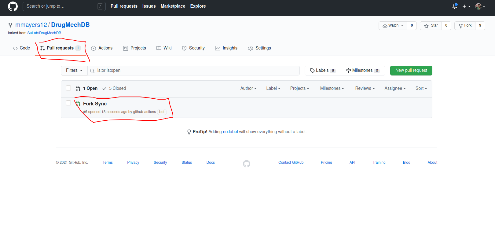

#### Merge the new request

Merge the new pull request to receive the changes.

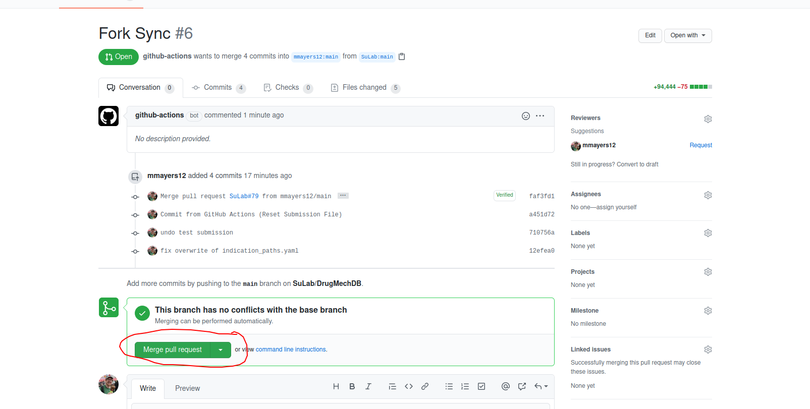

****